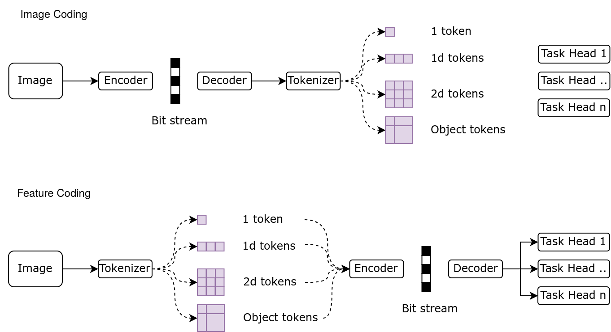

# Poetry 环境管理

添加包
```sh
poetry add <package>
```
# GIT 管理

最初的分支为 dev，稍后功能完整后发布到 main 分支。

每个人开一个新分支。
比如：
```sh
git checkout -b dev/add-new-feature
```
如何提交：
```sh
git push origin dev/add-new-feature
```
提交后，在 GitHub 上创建一个 Pull Request，然后合并到 dev 分支。


## 测试 pipeline 类别



- 编码图像
  - Create model
  - Create dataset/dataloader
  - Compress Image
  - Extract features
  - Eval features

- 编码特征
  - Create model
  - Create dataset/dataloader
  - Extract features
  - Compress features
  - Eval features

 
## 测试 pipeline 命名规定
- Image Coding
  - Exec: mpcompress / eval / run_{coding}_{model}_{task}.py
    - vtm_dinov2_cls (原分辨率)
    - vtm_dinov2-cls_cls （Resize224）
    - vqgan_dinov2_cls (原分辨率)
  - TestDir: data / test-ic / {dataset}--{coding}
- Feature Coding
  - Exec: mpcompress / eval / run_{model}_{coding}_{task}.py
    - dinov2_vtm_cls (原分辨率)
    - dinov2-cls_vtm_cls  （Resize224）
    - mpc_mpc_multi  (原分辨率，多任务)
  - TestDir: data / test-fc / {dataset}--{model} / {coding}