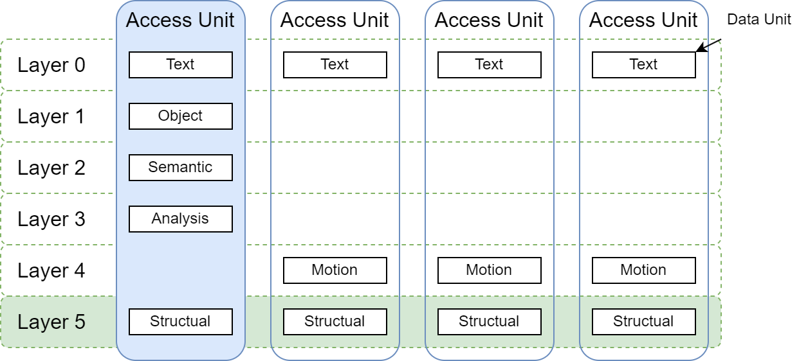
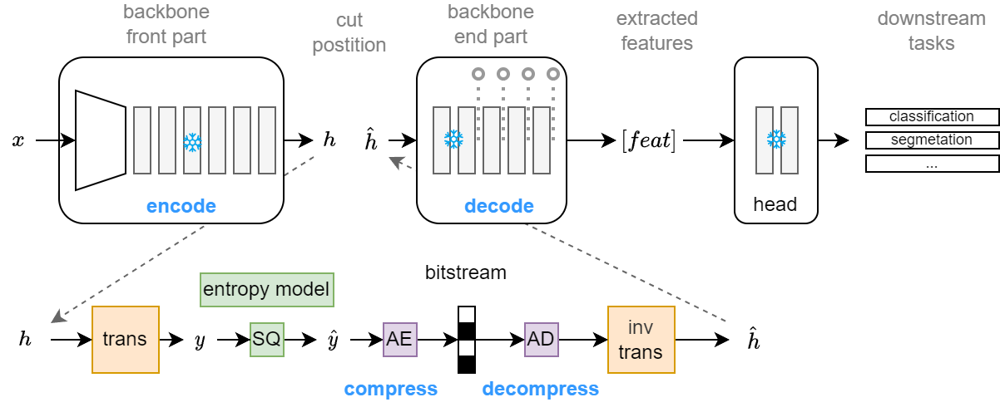

# Reference Software Design Framework

## 1. Overview

### 1.1 Overview of the Multi-layer Representation Video Coding Framework

To be compatible with various existing and potential future coding schemes and application requirements, this document proposes a flexible and extensible multi-layer representation video coding framework. This framework draws from the architecture of classic video coding and adopts a group-based processing method using Groups of Pictures (GoP) or Coded Video Sequences (CVS). Each CVS contains several Access Units (AUs) arranged in decoding order. Each AU corresponds to a specific timestamp and can consist of one or more Data Units (DUs), where each DU carries and only carries one specific representation of the complete image at that moment. This representation can be an image, text description, segmentation mask, depth map, other attribute information, or compact features extracted by large models.

In terms of organization, different DUs within the same AU are distinguished into different Layers; within a CVS, all temporally consecutive DUs belonging to the same layer together form a Coded Layer Video Sequence (CLVS). If a bitstream contains only a single layer, the CVS is equivalent to the CLVS. Figure 1 clearly illustrates the correspondence between AUs (vertical grouping along the time dimension) and CLVS (horizontal sequences along the representation dimension).



It should be noted that to maintain terminological compatibility with traditional codecs, the Data Unit (DU) is described similarly to the Picture Unit (PU) or the term "picture".

### 1.2 Common Layer Types

Each layer refers to a specific data modality or form of data representation. Different types of DUs are defined as follows:

- **Text DU**: Carries text information recognized from or associated with the visual scene, including subtitles, sign text, scene descriptions, etc. This type of DU specifies the use of the LZ series of lossless compression algorithms (e.g., LZ77, LZMA) for encoding to achieve efficient data compression.
- **Object DU**: Carries structured data obtained from object detection or semantic segmentation, including object bounding boxes, class labels, confidence scores, and possible mask information, etc. This type of DU follows the encoding algorithm defined in relevant standard proposals.
- **Feature DU**: Carries deep feature tensors extracted from raw pixels. This type of DU employs deep learning-based feature coding or tokenization coding techniques. This process only creates a compact representation of the features without pixel-level reconstruction.
- **Pixel DU**: Carries video frame data encoded in traditional ways (e.g., I, P, B frames), corresponding to VCL NALUs in H.266/VVC. It serves as a backward compatibility guarantee to support human visual viewing or as a reference base for other modalities.

On the encoding side, different layers can be flexibly selected and combined according to specific task requirements.

### 1.3 Key Term Definitions

| Term | Abbreviation | Definition |
|------|--------------|------------|
| Coded Video Sequence | CVS | A complete coding unit containing several Access Units (AUs) arranged in decoding order. |
| Access Unit | AU | Corresponds to a specific timestamp, a logical collection containing all Data Units (DUs) for that moment. |
| Data Unit | DU | The basic coding unit that carries a specific representation (e.g., image, text, feature, etc.) of the complete image at a moment. |
| Coded Layer Video Sequence | CLVS | Within a CVS, a sequence formed by all temporally consecutive DUs belonging to the same Layer. |
| Layer | Layer | Refers to a specific data modality or form of data representation. An AU can contain multiple layers. |

## 2. Framework Design

### 2.1 Compression of Feature Data Unit

The Feature DU employs a specialized deep learning-based codec flow, whose abstract framework is shown in the figure.



**Flow Description:**

- **Encoder Side**: Input image `x` is first passed through a **Feature Encoder** (the first half of the Backbone) to extract intermediate features `h`. Then, `h` is compressed, encoded, and transmitted.
- **Decoder Side**: Receives the bitstream, decodes it to obtain the intermediate feature representation, then passes it through a **Feature Decoder** (the second half of the Backbone) to recover the multi-layer features `[feat]` required for downstream tasks. Finally, the features are fed into a lightweight task-specific Head to obtain outputs for specific tasks such as classification, segmentation, etc.

**Clarification of Key Terms:**

- **Feature Encoder**: The first half of the Backbone, used to extract compressible intermediate features from the input image.
- **Feature Decoder**: The second half of the Backbone, used to recover task-specific features from the decoded intermediate features.
- **Compress**: Refers to the entire process from input image to generating the bitstream `strings`.
- **Decompress**: Refers to the entire process from receiving the bitstream `strings` to outputting the final task result.

### 2.2 Coded Unit format of Compression

In the design, the DU compression flow separates data encoding from syntax reading/writing, corresponding to the data part and the High-Level Syntax (HLS) elements in the bitstream, respectively. The experimental phase can focus on data compression; engineering implementation requires implementing complete syntax reading/writing.

For a single data unit, its encoded intermediate representation `coded_unit` is as follows (example):

```python
coded_unit = {  # adapted CompressAI format
    "strings": {"vtm": [[bin]], "y": [[bin], [bin]]},
    "pstate": {... },
}
```

The processing flow at the encoder and decoder sides is as follows:

```python
# Encoder side
coded_unit = compress(x)
buff = write_du_by_syntax(coded_unit)
# Decoder side
coded_unit = read_du_by_syntax(buff)
task_feats = decompress(coded_unit)
# task_feats: {"x_hat": xx, "cls": xx, "seg": xx, ...}
```

Where:

- **`strings`**: Encoded data that can be directly written to the bitstream.
- **`pstate`**: State information that needs to be synchronized between encoder and decoder, such as frame type, QP, shape, and other metadata, corresponding to high-level syntax elements. In the `write_syntax` function, `pstate` is further processed, distributing different information across syntaxes like SPS, PPS, PH, etc., which can improve coding efficiency.
- **`task_feats`**: The decoded reconstructed data unit, containing reconstructed data and possible task outputs (e.g., classification `cls`, segmentation `seg`).

In the technical research phase, syntax reading/writing can be omitted for now, passing `coded_unit` between `compress` and `decompress`, and only the code size of the `strings` part is counted.

### 2.3 Organization of Coded Units

The previous section described the compression and decompression process for a single Data Unit (DU). In actual video coding, a sequence contains multiple Access Units (AUs) at different timestamps, and each AU may contain multiple types of DUs. Therefore, these DUs need to be reasonably organized to form a complete bitstream.

For a multi-layer image frame, its encoded intermediate representation is `coded_data`, agreed as follows:

```python
coded_data = {
    "type": "frame",
    "data": {
        "layer1": {"strings": ..., "pstate": ...},  # DU for layer 1
        "layer2": {"strings": ..., "pstate": ...},  # DU for layer 2
        # ... Can include more layers
    },
}
```

For a multi-layer video sequence, its encoded intermediate representation `coded_data` supports two main organization methods: **FrameWise (organized by frame)** and **LayerWise (organized by layer)**. The LayerWise method is primarily designed for research convenience. The intermediate representation `coded_data` is agreed as follows:

```python
# Method 1: FrameWise (organized by temporal frame) - Closer to playback and decoding order
coded_data = {
    "type": "frame_wise_video",
    "data": {
        0: {  # Frame 0 (AU#0)
            "layer1": {"strings": ..., "pstate": ...},  # DU for layer 1
            "layer2": {"strings": ..., "pstate": ...},  # DU for layer 2
            # ... Can include more layers
        },
        1: {  # Frame 1 (AU#1)
            "layer1": {"strings": ..., "pstate": ...},
            "layer2": {"strings": ..., "pstate": ...},
        },
        # ... More frames
    }
}

# Method 2: LayerWise (organized by layer) - Convenient for layer-based access and processing
coded_data = {
    "type": "layer_wise_video",
    "data": {
        "layer1": {  # All DUs for layer 1 across the entire sequence
            0: {"strings": ..., "pstate": ...},  # layer1 DU for frame 0
            1: {"strings": ..., "pstate": ...},  # layer1 DU for frame 1
        },
        "layer2": {  # Layer 2 (e.g., may directly call an existing video encoder)
            "video": {"strings": ..., "pstate": ...}  # Single segment bitstream for the entire layer2 sequence
        },
    }
}
```

**Design Considerations:**
The two-level dictionary structure (`frame/layer -> DU`) is designed considering the complexity of practical applications:

1.  **Bitstream order and playback order may differ** (e.g., B-frames).
2.  **Not all frames contain all layers** (some layers may not exist frame-by-frame, e.g., only keyframes have complete features).

**Debugging Tools:**
For the complex `coded_data` structure, the reference software provides helper functions to quickly view its shape information:
```python
from mpcompress.utils.debug import extract_shape
structure_info = extract_shape(coded_data)
```

## 3. Codec Interfaces

### 3.1 DataUnitCodec

`DataUnitCodec` is the basic component for encoding and decoding a single Data Unit (DU), applicable to various types of DUs such as Feature DUs, Pixel DUs, etc. This interface provides unified compress and decompress methods and serves as the foundation for building complex video codecs.

#### 3.1.1 Core Interface

All types of `DataUnitCodec` should implement the following interface:

```python
class DataUnitCodec:
    """Base class for data unit codecs"""

    def compress(self, x, **kwargs):
        """
        Compresses a single data unit, returns the intermediate representation coded_unit.

        Args:
            x: Input data unit, can be a feature tensor, image, text, etc.
            **kwargs: Optional encoding parameters (e.g., QP, configuration parameters)

        Returns:
            coded_unit: The encoded intermediate representation, containing strings and pstate.
        """

        # Example implementation structure
        coded_unit = {
            "strings": {
                "y": [[bin], [bin], ...],  # Binary encoded stream
            },
            "pstate": {
                "shape": x.shape,      # Data shape
                "frame_type": "I",     # Frame type
                "qp": 32,              # Quantization parameter
                # Other state information...
            }
        }
        return coded_unit

    def decompress(self, coded_unit, **kwargs):
        """
        Decodes a single data unit from coded_unit, returns the reconstructed data.

        Args:
            coded_unit: The coded_unit dictionary returned by compress.
            **kwargs: Optional decoding parameters (e.g., task type, output format)

        Returns:
            task_feats: The decoded data, containing reconstructed data and task-related outputs.
        """

        # Example implementation structure
        task_feats = {
            "x_hat": x_hat,  # Reconstructed data unit
            "cls": f_cls,  # Classification result (optional)
            "seg": f_seg,   # Segmentation result (optional)
            "feats": [feat1, feat2, ...],  # Intermediate features (optional)
            # Other task-related outputs...
        }
        return task_feats
```

### 3.2 FrameCodec

`FrameCodec` is responsible for handling the encoding and decoding of a single Access Unit (AU), i.e., the collaborative encoding and decoding of all Data Units (DUs) at the same moment. An AU may contain multiple DUs from different layers and inter-layer dependencies. `FrameCodec` needs to coordinate the codec processes of these DUs.

#### 3.2.1 Core Interface

```python
class FrameCodec:
    """Base class for multi-layer frame-level codec, processing a single Access Unit (AU)"""

    def __init__(self, layer_configs):
        self.layer_configs = layer_configs
        for layer, config in layer_configs:
            self.backbones[layer] = create_backbone(config.backbone)
            self.codecs[layer] = create_codec(config.codec)

    def compress(self, x, **kwargs):
        """
        Compresses a single Access Unit (single frame), returns the frame-level intermediate representation coded_data.

        Args:
            x: Image input for the current AU.
            **kwargs: Extra encoding parameters (e.g., QP, task configuration).

        Returns:
            coded_data: Frame-level intermediate representation, structured as:
                {
                    "type": "frame",
                    "data": {
                        "layer1": coded_unit_1,
                        "layer2": coded_unit_2,
                        # ...
                    },
                }
        """
        coded_data = {"type": "frame", "data": {}}

        for layer_name in self.layer_order:
            codec = self.codecs[layer_name]
            backbone = self.backbones[layer_name]
            x_layer = backbone.encode(x)
            coded_unit = codec.compress(x_layer, **kwargs)
            coded_data["data"][layer_name] = coded_unit

        return coded_data

    def decompress(self, coded_data, tasks=[], **kwargs):
        """
        Decodes a single Access Unit from the frame-level intermediate representation coded_data, returns task-related outputs.

        Args:
            coded_data: The dictionary returned by compress_frame.
            tasks: Optional task list, e.g., ["rec1", "rec2", "cls", "seg"],
                   specific implementations interpret the meaning of different tasks.
            **kwargs: Extra decoding parameters (e.g., context needed for cross-layer dependencies).

        Returns:
            task_feats: Task output dictionary, generally in the form:
                {
                    "rec": x_hat,      # Reconstruction result
                    "cls": cls_logits, # Classification result
                    "seg": seg_mask,   # Segmentation result
                    # ... Other task outputs
                }
        """

        task_feats = {}
        # Iterate through layers, decode and aggregate task outputs as needed
        for layer_name in self.layer_order:
            if layer_name not in coded_data["data"]:
                continue
            codec = self.codecs[layer_name]
            backbone = self.backbones[layer_name]
            coded_unit = coded_data["data"][layer_name]
            decoded = codec.decompress(coded_unit, **kwargs)
            layer_feats = backbone.decode(decoded, tasks=tasks)
            # Different layers can contribute results for different tasks, merge them here uniformly
            if layer_feats is not None:
                task_feats.update(layer_feats)

        return task_feats
```

### 3.3 VideoCodec

#### 3.3.1 Core Interface

It is stipulated that all types of `VideoCodec` should implement the `compress_video` and `decompress_video` methods, operating on the `coded_data` intermediate representation.

```python
def compress_video(video_reader, **kwargs):
    """
    Compresses an entire video sequence, returns the coded_data intermediate representation.

    Args:
        video_reader: A video reader object supporting iterative frame data reading.
        **kwargs: Optional encoding parameters (e.g., layer selection, QP).

    Returns:
        coded_data: coded_data dictionary, of type "frame_wise_video" or "layer_wise_video".
    """
    init_compress()
    coded_data = {"type": "frame_wise_video", "data": {}}  # Using FrameWise as example here
    for idx, frame in enumerate(video_reader):
        # Call compress_frame to process a single frame, which internally calls compress for each layer
        coded_frame = compress_frame(frame)
        # coded_frame: {"layer1": {strings, pstate}, "layer2": {strings, pstate}, ...}
        coded_data["data"][idx] = coded_frame
    return coded_data


def decompress_video(coded_data, **kwargs):
    """
    Decodes an entire video sequence from the coded_data intermediate representation.

    Args:
        coded_data: The coded_data dictionary returned by compress_video.
        **kwargs: Optional decoding parameters (e.g., specifying a task).

    Returns:
        results: Dictionary where keys are frame indices and values are decoded reconstructed data and task results.
    """
    init_decompress()
    assert coded_data["type"] == "frame_wise_video"  # Example, needs to match actual type
    results = {}
    for idx, coded_frame in coded_data["data"].items():
        # Call decompress_frame to process a single frame
        task_feats = decompress_frame(coded_frame)
        # task_feats: {"x_hat": xx, "cls": xx, "seg": xx, ...}
        results[idx] = task_feats
    return results
```
*Note: End-to-end type VideoCodecs should additionally implement the `compress_frame` and `decompress_frame` methods.*

#### 3.3.2 Serialization Interface

To generate binary bitstreams conforming to standard syntax, the `compress_video_stream` and `decompress_video_stream` methods should be implemented.

```python
def compress_video_stream(video_reader, **kwargs):
    """
    Compresses video and directly generates binary bitstream.

    Args:
        video_reader: Video reader object.
        **kwargs: Optional encoding parameters.

    Returns:
        buff: Binary buffer containing the complete compliant bitstream.
    """
    init_compress()
    for frame in video_reader:
        coded_frame = compress_frame(frame)
        # Write strings and pstate from coded_data into buff according to syntax
        buff = write_frame_by_syntax(coded_frame)
    close_write()
    return buff


def decompress_video_stream(buff, **kwargs):
    """
    Decodes video from binary bitstream.

    Args:
        buff: Binary buffer containing the video bitstream.
        **kwargs: Optional decoding parameters.

    Returns:
        results: List storing the reconstructed data and task results for each frame in decoding order.
    """
    init_decompress()
    results = []
    for _ in range(frame_num):  # Total frame count needs to be obtained from bitstream header or parameters
        coded_frame = read_frame_by_syntax(buff)
        task_feats = decompress_frame(coded_frame)
        # task_feats: {"x_hat": xx, "cls": xx, "seg": xx, ...}
        results.append(decoded)
    close_read()
    return results
```

## 3.4 Auxiliary Syntax Read/Write Function Conventions

Developers may need to implement the following auxiliary functions to handle syntax based on the chosen coding level:
- `write_frame_by_syntax`, `read_frame_by_syntax`: Handle frame-level syntax.
- `write_du_by_syntax`, `read_du_by_syntax`: Handle DU-level syntax.

## 4 Other Interfaces

### 4.1 Dataset Interface

#### 4.1.1 Image Dataset

Image datasets uniformly return the `(img, img_meta)` format to support flexible preprocessing pipelines.

The recommended format for `img_meta` is as follows:
```python
img_meta = {
    "img_path": "/data/000.png",           # Image file path
    "img_name": "000",                     # Image file name (without extension)
    "ori_size": (640, 480),                # Original image size (width, height)
    "target": 135,                         # Overall classification label (optional)
    "seg_label_path": "/anno/000.png"      # Segmentation label path (optional)
}
```

#### 4.1.2 Video Dataset

Video datasets uniformly return the `(video_reader, video_meta)` format.

The recommended format for `video_meta` is as follows:
```python
video_meta = {
    "seq_name": "Beauty_1920x1080.yuv",    # Sequence name
    "src_width": 1920,                     # Original image width
    "src_height": 1080,                    # Original image height
    "frame_num": 64,                       # Total frame count
    "cls_labels": [],                      # Frame-by-frame classification label list (optional)
    "seg_label_paths": []                  # Frame-by-frame segmentation label path list (optional)
}
```

The `video_reader` object supports reading YUV420 sequences or PNG image folders and provides a unified interface for frame data access:

```python
frame = video_reader.read_one_frame()
# Supports accessing multiple formats via attributes
y_plane = frame.y
u_plane = frame.u
v_plane = frame.v
yuv444_data = frame.yuv444
rgb_data = frame.rgb
```